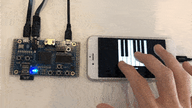
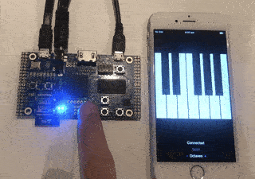

# mobile-fpga-bluetooth-midi

This is an interactive MIDI demo using Bluetooth (BLE-MIDI), a mobile app (iOS + SwiftUI), an ESP32 (running MicroPython) and an FPGA (implementing a Verilog design).

The FPGA board used in this demo is the [ULX3S](https://github.com/emard/ulx3s) which contains the ESP32 and FPGA. The FPGA is used to implement a [multichannel ADPCM decoder/mixer](https://github.com/dan-rodrigues/ics-adpcm), which outputs both analog and digital audio from the 3.5mm headphone jack. There is additional logic to control the ADPCM core over Bluetooth using an SPI interface provided by the ESP32. There is also an integrated tracker that automatically plays a song while sending corresponding MIDI messages for display on the mobile app.

The ESP32 implements a BLE peripheral which sends and receives messages using a custom iOS app. This mobile app provides a piano-like interface for the user to send MIDI messages for playback using the FPGA, while also displaying notes which were triggered by the FPGA itself.




## Prerequisites

### FPGA and ESP32 (Server)

* [MicroPython](https://github.com/micropython/micropython) must be preinstalled on the ESP32. The [esp32ecp5](https://github.com/emard/esp32ecp5) repo has instructions on setting this up. MicroPython 1.13 is used for this demo.
* [yosys](https://github.com/YosysHQ/yosys)
* [nextpnr-ecp5](https://github.com/YosysHQ/nextpnr)
* [fujprog](https://github.com/kost/fujprog)

### Mobile app (Client)

* Xcode 12.0.0 or newer
* iPhone / iPad running iOS14 or newer

The client provides a basic interface to a BLE-MIDI peripheral such as the one implemented by the ESP32 software in this project. It doesn't implement the full BLE-MIDI spec, but other MIDI software with Bluetooth connectivity can be used instead.

## Usage

### Submodules

An FPGA project containing the ADPCM core is in a submodule and must be pulled first.

```
git submodule update --init
```

### Flashing FPGA bitstream

The [rtl/ics-adpcm/demo](https://github.com/dan-rodrigues/ics-adpcm/tree/master/demo) directory contains the sources to build the FPGA bitstream. This includes a UART passthrough for the ESP32 for console interaction.

The Makefile must be configured according to the size of the ECP5. Default is 85F.

```
cd rtl
make ulx3s_prog
```

### ESP32 configuration

It's assumed that MicroPython has already been flashed to the ESP32 as mentioned above.

The files in the [esp32/](esp32/) directory need to be copied to the ESP32. The included main.py file is automatically run by MicroPython on startup. If this isn't wanted, it can be renamed and manually started with an `import` statement in the REPL. When the ESP32 program starts, it should print regular status updates.

* [webrepl](https://github.com/micropython/webrepl) can be used to copy files to upload files remotely.
* [rshell](https://github.com/dhylands/rshell) can be used to upload files over the console.

The ESP32 variant used on the test board is WROOM, which has limited RAM but had no apparent issues running the software.

### Mobile app

Once the FPGA has been configured and the ESP32 is running, the included app in the [iOS/](iOS/) directory can connect to the ESP32 by tapping the "Scan" button.

## Controls

After connecting with Bluetooth, both the mobile app and the buttons on the FPGA can be used to control playback of individual notes.

Details on how to control the ADPCM demo project from the FPGA can be found [here](https://github.com/dan-rodrigues/ics-adpcm/tree/master/demo#demo). 
